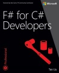

If you want to learn more about F# or if you want to teach it, you can find
more information in one of the existing F# books or other online tutorials 
available online. This page lists the existing F# books and provides links
to some of the F# tutorials available online.

## Interactive tutorials

[Try F#](http://www.tryfsharp.org) is an interactive environment where you can
explore F# in your web browser (on Mac and Windows). It contains a number
of online tutorials demonstrating the power of F# and F# 3.0:

 * [Getting started in F#](http://www.tryfsharp.org/Learn/getting-started)
 * [Advanced F# Programming](http://www.tryfsharp.org/Learn/advanced-programming)
 * [Data Visualization and Charting](http://www.tryfsharp.org/Learn/data-visualization)
 * [Data Science](http://www.tryfsharp.org/Learn/data-science)
 * [Scientific and Numerical Computing](http://www.tryfsharp.org/Learn/scientific-computing)
 * [Financial Computing](http://www.tryfsharp.org/Learn/financial-computing)
 
## F# Books - General

### [Building Web, Cloud, and Mobile Solutions with F#](http://shop.oreilly.com/product/0636920026099.do)

_Daniel Mohl_

Learn how to build key aspects of web, cloud, and mobile solutions by combining F# with various .NET and open source technologies. With helpful examples, this hands-on book shows you how to tackle concurrency, asynchrony, and other server-side challenges. You’ll quickly learn how to be productive with F#, whether you want to integrate the language into your existing web application or use it to create the next Twitter. 

&#160;

### [Beginning F#](http://www.apress.com/9781430223894)

_Robert Pickering_

Functional programming is perhaps the next big wave in application development. 
With Beginning F#, you have a companion that that will help you explore F# and 
functional programming in a .NET environment. This book is both a comprehensive 
introduction to all aspects of the language and an incisive guide to using F# for 
real-world professional development.

### [Programming F# 3.0](http://shop.oreilly.com/product/0636920024033.do)

_Chris Smith_

Why learn F#? This multi-paradigm language not only offers you an enormous 
productivity boost through functional programming, it also lets you develop
applications using your existing object-oriented and imperative programming 
skills. With Programming F#, you'll quickly discover the many advantages 
of Microsoft's new language, which includes access to all the great tools 
and libraries of the .NET platform.

### [F# For C# Developers](http://blogs.msdn.com/b/microsoft_press/archive/2013/06/03/rtm-d-today-f-for-c-developers.aspx)

_Tao Liu_

People often ask, “What can F# do that C# cannot?” In this book, you will discover much 
of what F# can do! You will see familiar things such as object programming and design 
patterns. Further, you will also see powerful new things like pattern matching, piping, 
first-class events, object expressions, options, tuples, records, discriminated unions, 
active patterns, agents, computation expressions and, perhaps most distinctively, type providers. 

### [Expert F# 3.0](http://www.apress.com/9781430246503)

_Don Syme, Adam Granicz, Antonio Cisternino_

Expert F# 3.0 is about practical programming in a beautiful language that puts the 
power and elegance of functional programming into the hands of professional 
developers. In combination with .NET, F# achieves unrivaled levels of programmer 
productivity and program clarity. 

### [Real World Functional Programming](http://www.manning.com/petricek/)

_Tomas Petricek with Jon Skeet_

Real World Functional Programming is a unique tutorial that explores the 
functional programming model through the F# and C# languages. The clearly 
presented ideas and examples teach readers how functional programming 
differs from other approaches. It explains how ideas look in F#-a 
functional language-as well as how they can be successfully used to solve 
programming problems in C#. Chapters from this book available on 
[MSDN page] (http://msdn.microsoft.com/en-us/library/hh297121)

### [F# for Scientists](http://eu.wiley.com/WileyCDA/WileyTitle/productCd-0470242116.html)

_Jon Harrop_

Over the next five years, F# is expected to become one of the world's most popular 
functional programming languages for scientists of all disciplines working on the 
Windows platform. F# is free and, unlike MATLAB and other software with numerical/scientific 
origins, is a full-fledged programming language. F# for Scientists explains and 
demonstrates the powerful features of this important new programming language. 

### [Visual F# 2010 for Technical Computing] (http://www.ffconsultancy.com/products/fsharp_for_technical_computing/)

_Jon Harrop_

Read this full-color book to learn how Microsoft's new Visual F# 2010 programming 
language can be used as a next-generation platform for high-performance interactive 
technical computing. Topics covered include the latest version of the F# 
language, parallel programming with .NET 4, Windows Presentation Foundation for 
visualization, concurrent programming with asynchronous workflows, and many others.

### [Professional F# 2.0] (http://eu.wiley.com/WileyCDA/WileyTitle/productCd-047052801X.html)

_Ted Neward, Aaron Erickson, Talbott Crowell, Rick Minerich_

This is a book on the F# programming language. The authors are not attempting 
to teach developers how to accomplish tasks from other languages in this one, 
nor are they attempting to evangelize the language or its feature set or its 
use "over" other languages. They assume that you are considering this book 
because you have an interest in learning the F# language.

## Tutorials

This section lists of some of the freely available online tutorials on F#. 
You can browse these online guides to find explanation of all important 
F# language features and see many interesting examples.

### [F# for Fun and Profit] (http://fsharpforfunandprofit.com/)

This site will introduce you to F# and show you ways that F# can help in day-to-day development
of mainstream commercial business software

### [Try F#] (http://tryfsharp.org/)

Learn, create and share F# code, in your browser.

### [F# Programming Wikibook] (http://en.wikibooks.org/wiki/Programming:F_Sharp)

The wikibook contains a comprehensive guide to F# programming. It covers 
F# language basics and essential functional programming concepts such as 
working with functions and immutable data structures. It also discusses 
imperative and object-oriented programming in F# and advanced langauge 
features such as active patterns and computation expressions.

### [Real World Functional Programming] (http://msdn.microsoft.com/en-us/library/hh314518)

This part of MSDN contains chapters from the book by Tomas Petricek and Jon Skeet with
additional material on Numerical Computing by Yin Zhu

