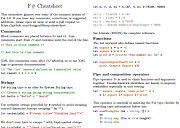

To learn F# use one of the free online resources or books below.

### [F# for C#, Java or Python developers](http://fsharpforfunandprofit.com/)

Introduces you to F# and show you ways that F# can help in day-to-day development
of mainstream commercial business software.

### [F# Cheat Sheet](http://dungpa.github.io/fsharp-cheatsheet/)

The cheat sheet is a small and concise guide to F# syntax for newcomers to get started with the language. It's available in [HTML](http://dungpa.github.io/fsharp-cheatsheet/) and [PDF](https://github.com/dungpa/fsharp-cheatsheet/raw/gh-pages/fsharp-cheatsheet.pdf) format.

### [The F# Koans](https://github.com/ChrisMarinos/FSharpKoans#functional-koans---f)

Learn F# by just filling in the gaps! The F# Koans are a fun set of code snippets where you have to fill in gaps to get tests to pass, and you learn the language along the way.  Also available as a [snippet](http://fssnip.net/bG) which can be loaded into interactive environments or your editor of choice.

### [F# Snippets](http://fssnip.net/)

A collection of snippets of F# code.

### [.NET Fiddle](https://dotnetfiddle.net/)

Allows you to try F# code in your browser. You an also view generated IL, and load some
NuGet packages (not all packages load correctly in .NET Fiddle).

### [F# Guide and Visual F# Development Portal](https://docs.microsoft.com/en-us/dotnet/articles/fsharp/)

 

The Microsoft documentation for F# provides a language reference, walkthroughs, videos, samples, and more.  You can also
contribute to the documentation on GitHub.

### [F# Programming Wikibook](http://en.wikibooks.org/wiki/Programming:F_Sharp)

The wikibook contains a comprehensive guide to F# programming. It covers
F# language basics and essential functional programming concepts such as
working with functions and immutable data structures. It also discusses
imperative and object-oriented programming in F# and advanced langauge
features such as active patterns and computation expressions.

### [Analyzing and Visualizing Data with F#](http://www.oreilly.com/programming/free/analyzing-visualizing-data-f-sharp.csp)

_Tomas Petricek_

This report explains many of the key features of the F# language that make it a great tool for data science and machine learning. Real world examples take you through the entire data science workflow with F#, from data access and analysis to presenting the results. You'll learn about F# Data and type providers, the process of data analysis with Deedle and R type provider and the implementation of basic machine learning algorithm with F#.

### [F# Workshop Materials](http://fsharpworkshop.com/)

Material from the F# Introduction Workshop created by Jorge Fioranelli.

### [Community for F# Coding Dojos](http://c4fsharp.net/#fsharp-coding-dojos)

A range of coding dojos for F# from [Community for F#](http://c4fsharp.net) including the famous
[Digits Recognizer](https://github.com/c4fsharp/Dojo-Digits-Recognizer), [Fractal Forest](https://github.com/c4fsharp/Dojo-Fractal-Forest), [Canopy 2048](https://github.com/c4fsharp/Dojo-Canopy-2048),
[Markov Bot](https://github.com/c4fsharp/Dojo-Markov-Bot), [Type Provider Treasure Hunt](https://github.com/c4fsharp/Dojo-Type-Provider-Treasure-Hunt), [Classics Mash-up](https://github.com/c4fsharp/Dojo-Picasquez-and-Velasso) and [Ham or Spam](https://github.com/c4fsharp/Dojo-Ham-Or-Spam) dojos.

### [F# Developer Network (FSDN)](http://fsdn.azurewebsites.net/)

Site which allows interactive searches by an F# API. The [F# API Search library](https://github.com/hafuu/FSharpApiSearch) document describes the search formats, which support the standard signature of F# with some extentions.  
Source code available on [GitHub FSDN](https://github.com/fsdn-projects/FSDN)

<h2 id="courses" class="anchor">F# Courses - General</h2>

### [Introduction to F#](https://fsharp.tv/courses/fsharp-programming-intro/)

FSharpTV is a crowdfunded company that produces F# courses with practical, real-world examples. The introductory course is free and accessible to everyone, including beginners.

<h2 id="books" class="anchor">F# Books - General</h2>

### [Building Web, Cloud, and Mobile Solutions with F#](http://books.google.com/books?id=dZrslEoAb58C)

_Daniel Mohl_

Learn how to build key aspects of web, cloud, and mobile solutions by combining F# with various .NET and open source technologies. With helpful examples, this hands-on book shows you how to tackle concurrency, asynchrony, and other server-side challenges. You’ll quickly learn how to be productive with F#, whether you want to integrate the language into your existing web application or use it to create the next Twitter.

### [Beginning F# 4.0](https://books.google.com/books?id=puQgDAAAQBAJ)

_Robert Pickering, Kit Eason_

This book is a great foundation for exploring functional-first programming and
its role in the future of application development. The best-selling introduction to F#,
now thoroughly updated to version 4.0, will help you learn the language and explore
its new features.

### [Programming F# 3.0](https://books.google.com/books?isbn=1449326048)

_Chris Smith_

Why learn F#? This multi-paradigm language not only offers you an enormous
productivity boost through functional programming, it also lets you develop
applications using your existing object-oriented and imperative programming
skills. With Programming F#, you'll quickly discover the many advantages
of Microsoft's new language, which includes access to all the great tools
and libraries of the .NET platform.

### [F# For C# Developers](https://books.google.com/books?isbn=0735670226)

_Tao Liu_

People often ask, “What can F# do that C# cannot?” In this book, you will discover much
of what F# can do! You will see familiar things such as object programming and design
patterns. Further, you will also see powerful new things like pattern matching, piping,
first-class events, object expressions, options, tuples, records, discriminated unions,
active patterns, agents, computation expressions and, perhaps most distinctively, type providers.

### [Expert F# 4.0](https://books.google.com/books?isbn=1484207424)

_Don Syme, Adam Granicz, Antonio Cisternino_

Expert F# 4.0 is about practical programming in a beautiful language that puts the power and elegance of data-rich functional programming into the hands of professional developers. In combination with .NET, F# achieves unrivaled levels of programmer productivity and program clarity.

 - A comprehensive guide to F# by the inventor of F#
 - A treasury of F# techniques for practical problem-solving
 - An in-depth case book of how F# applications and of F# 4.0 concepts, syntax, and features
 
The world's experts in F# show you how to program in F# the way they do!

### [Real World Functional Programming](https://books.google.com/books?isbn=1933988924)

_Tomas Petricek with Jon Skeet_

Real World Functional Programming is a unique tutorial that explores the
functional programming model through the F# and C# languages. The clearly
presented ideas and examples teach readers how functional programming
differs from other approaches. It explains how ideas look in F#-a
functional language-as well as how they can be successfully used to solve
programming problems in C#.

### [Functional Programming Using F#](https://books.google.com/books?isbn=1107019028)

_Michael R. Hansen, Hans Rischel_

This comprehensive introduction to the principles of functional programming using F#
shows how to apply basic theoretical concepts to produce succinct and elegant programs.
It demonstrates the role of functional programming in a wide spectrum of applications
including databases and systems. Coverage also includes advanced features in the .NET
library, the imperative features of F# and topics such as text processing, sequences,
computation expressions and asynchronous computation. With a broad spectrum of examples
and exercises, the book is perfect for courses in functional programming and for self-study.
Enhancing its use as a text is an accompanying website with downloadable programs, lecture
slides, a mini-projects and links to further F# sources.

### [F# for Scientists](https://books.google.com/books?isbn=1118210816)

_Jon Harrop_

F# for Scientists explains and demonstrates the powerful features of this important new
programming language. The book assumes no prior experience and guides the reader from
the basics of computer programming to the implementation of state-of-the-art algorithms.
Written in a clear and concise style, F# for Scientists is well suited for researchers,
scientists. It also serves as an
ideal supplemental text for advanced undergraduate and graduate students with a background in science or engineering.

### [F# for Quantitative Finance](https://www.packtpub.com/big-data-and-business-intelligence/f-quantitative-finance)

_Johan Astborg_

This book will cover everything you need to know about using functional
programming for quantitative finance. Using a functional programming language
will enable you to concentrate more on the problem itself rather than
implementation details. Tutorials and snippets are summarized into an automated
trading system throughout the book.

In this book you will:

- Use Visual Studio as your main tool for writing F#
- Utilize F# to aggregate data and calculate statistics
- Plot and visualize data in F#
- Learn about volatility, delta hedging, and volatility arbitrage
- Understand basic numerical analysis and algorithm implementation
- Model orders and market data together with basic pre-trade risk
- Structure and write object-oriented code
- Develop larger programs using F#
- Explore automated trading systems and quantitative trading models

### [The Book of F#](https://books.google.com/books?isbn=1593275528)

_Dave Fancher_

The Book of F# aims to introduce intermediate and experienced developers to functional-first programming with F#. Throughout the book, you'll learn how this robust language can help you focus on creating correct solutions by introducing a variety of important concepts including currying, partial application, pattern matching, units of measure, asynchronous workflows, query expressions, type providers, and computation expressions. Furthermore, you'll discover how F#'s rich object-oriented capabilities allow it to naturally fit into existing applications.

### [Programming Language Concepts](https://books.google.com/books?isbn=1447141563)

_Peter Sestoft_

The book Programming Language Concepts (PLC) provides an introduction to programming language concepts and implementation technology, such as interpretation, compilation, type checking and type inference, abstract machines, and garbage collection. F# is used as a meta language throughout the book expressing all concepts and examples of programming language design in a modern strongly-typed language of the ML-family, enabling the reader to experiment with the ideas right away.

### [F# Deep Dives](https://books.google.com/books?isbn=1617291323)

_Tomas Petricek and Phillip Trelford_

F# Deep Dives presents a collection of real-world F# techniques, each written by expert practitioners. Each chapter presents a new use case where you'll read how the author used F# to solve a complex problem more effectively than would have been possible using a traditional approach. You'll not only see how a specific solution works in a specific domain, you'll also learn how F# developers approach problems, what concepts they use to solve them, and how they integrate F# into existing systems and environments.

### [Machine Learning Projects for .NET Developers](https://books.google.com/books?isbn=1430267666)

_Mathias Brandewinder_

Machine Learning Projects for .NET Developers shows you how to build smarter .NET applications that learn from data, using simple algorithms and techniques that can be applied to a wide range of real-world problems.

### [Mastering .NET Machine Learning](https://www.packtpub.com/big-data-and-business-intelligence/mastering-net-machine-learning)

_Jamie Dixon_

This book is packed with real-world examples to easily use machine learning techniques in your business applications. You will begin with introduction to F# and prepare yourselves for machine learning using .NET framework. You will be writing a simple linear regression model using an example which predicts sales of a product. Forming a base with the regression model, you will start using machine learning libraries available in .NET framework such as Math.NET, Numl.NET and Accord.NET with the help of a sample application. You will then move on to writing multiple linear regressions and logistic regressions.

### [Multi-Paradigm Programming Using F# and .NET](http://www.naghoospress.ir/bookview.aspx?bookid=1486730)

_Ali Baghernejad_

F# is the result of combining the  power and capabilities of functional programming with with the imperative and object-oriented paradigms of .NET. Multi-Paradigm Programming In F# is a book that help developers to make  
applications using F# tools and the .NET libraries. This book is written in Persian language in 509 pages.
In this book you will read:

- Introduction to F# (History and Advantages)
- Get Statring With F# (Installation, Interactive Environment, ...)
- F# Fundementals (Values, Primitive Types, Functions, Type Inference, Generic, ...)
- Advance Types (Lists, Tuples, Enums, Discriminated Union, Unit of Measures, ...)
- Functional Programming (Expressions, Imutability, Function Values, Pattern Matching, Piping, ...)
- Imperative Programming (Statements, Mutable Values, Side Effects, Arrays, Resource Management, ...)
- Object Oriented Programming (Objects, Classes, Inheritance, Abstraction, Polymorphism, ...)
- Error Handling (Exceptions, Exception Types, Throwing and Catching Exceptions, ...)
- Databases (Sql Server, Query Expressions, Type Providers, ...)
- User Interfaces (Windows Forms, WPF, GTK#)

### [F# Applied](http://products.tamizhvendan.in/fsharp-applied/)

_Tamizhvendan S_

“F# Applied” is an excellent introduction to applied, modern programming for the web. Starting with Suave, the F# server-side web framework, this book will teach you how to create complete applications using Functional-First Programming with F#
In this book you will read:

- How to create complete application using Functional Programming Principles using F#
- An in-depth understanding of Web development in F# using Suave
- How to develop applications using EventSourcing, CQRS, and DDD in F#
- How to set up continuous integration and continuous deployment using FAKE and Docker
- How to leverage libraries like Rx, FSharp.Data and Paket

### [Learn F#](https://www.manning.com/books/learn-fsharp)

_Isaac Abraham_

Learn F# is a practical guide for experienced C# and .NET developers that teaches the F# language, tools, techniques, and practices that can be applied in common scenarios. You’ll start with F# language basics and best development practices. You’ll also learn the core set of FP techniques in F#, and why to use them. Then you’ll discover how to write idiomatic F# code on the .NET framework in Visual Studio, and what tools to use to give you the best experience within VS. The second part of the book shows you how to apply F# in larger, real world scenarios, including features such as: -

- Interop with C# /VB projects
- Working with disparate data sources
- SQL database access
- Web Programming
- Unit testing.

By the end of the book, you’ll be able to use F# in your day-to-day development, and know how and where to deepen your knowledge.

### [F# for Machine Learning Essentials](https://www.packtpub.com/big-data-and-business-intelligence/f-machine-learning)

_Sudipta Mukherjee_

This book is a fast-paced tutorial guide that uses hands-on examples to explain real-world applications of machine learning. 

In this book you will:

- Use F# to find patterns through raw data
- Build a set of classification systems using Accord.NET, Weka, and F#
- Run machine learning jobs on the Cloud with MBrace
- Perform mathematical operations on matrices and vectors using Math.NET
- Use a recommender system for your own problem domain
- Identify tourist spots across the globe using inputs from the user with decision tree algorithms

### [F# 4.0 Design Patterns](https://www.packtpub.com/application-development/f-40-design-patterns)

_Gene Belitski_

This book will encourage enterprise developers coming to F# from other platforms to cultivate an idiomatic F# coding skillset by fully embracing the functional-first F# paradigm.

In this book you will:

- Acquire the practical knowledge to use the main functional design patterns
- Realign some imperative and object-oriented principles under the functional approach
- Develop your confidence in building and combining first-order and higher-order functions
- Learn to use core language pattern matching effectively
- Make use of native F# algebraic data types in place of custom-built classes
- Recognize and measure the difference in resource consumption between sequences and materialized data collections
- Navigate and use F# Core libraries with ease by seeing patterns behind specific library functions
- Master writing generic polymorphic code

### [Mastering F#](https://www.packtpub.com/application-development/mastering-f)

_Alfonso García-Caro Núñez & Suhaib Fahad_

This easy-to-follow guide with syntaxes will help you master the concepts of F#. Packed with in-depth examples of real-world uses, this book covers each topic in detail with a reference to C#, so you will understand the difference between the languages.

In this book you will:

- Understand the basics of F# and organize F# source code with Visual Studio
- Work with F# data structures and create functional data structures in F# interoperate with C#
- Build and use asynchronous programming patterns with F#
- Create and use type providers that help perform data analysis from within Visual Studio
- Develop applications with pure F# code in WPF or ASP.NET MVC
- Find out how to perform distributed programming with ServiceBus or ZeroMQ
- Visualize data with charts, and work with Excel and R language Type providers

### [F# High Performance](https://www.packtpub.com/application-development/f-high-performance)

_Eriawan Kusumawardhono_

This easy-to-follow guide is full of hands-on examples of real-world multithreading tasks. Each topic is explained and placed in context, and for the more inquisitive, there are also more in-depth details of the concepts used.

In this book you will:

- Understand how the execution of functions in F# works
- Identify common performance bottlenecks
- Implement best practices to optimize performance
- Use the available tooling to help measure performance
- Combine the best practice of asynchronous and synchronous
- Optimize further using various F# language constructs

### [Learning Basics of Functional Programming (Integrated Course)](https://www.packtpub.com/web-development/learning-basics-functional-programming-integrated-course)

_Onur Gumus_

Build end-to-end web applications with F# 
Develop web applications that includes server-side as well as the client-side programming using Fable, F# to JavaScript compiler.

- Learn F# with this learner-friendly approach in this course
- This single course covers all the basics so you can start building powerful applications
- Get familiar with all the top modules and components included in this course

## F# Books (Coming Soon)

### [Understanding Functional Programming](https://leanpub.com/understandingfunctionalprogramming)

_Scott Wlaschin_

A practical approach with examples in F#. Are you an experienced C#, Java or Python developer? Do you want to understand what all the fuss about functional programming is about? Designed for beginners, this book will explain all the core concepts of functional programming in a practical way with no maths or jargon.
