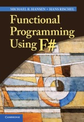
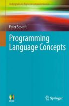

F# is a simple and expressive programming langauge. It can be described as statically typed 
impure functional language that supports functional, imperative and object-oriented paradigm 
and also several other programming styles including data-driven, event-driven and parallel 
programming. This makes it an excellent tool for introducing programming as well as programming 
paradigms. Using F# for teaching has several advantages:
 
 * **Simplicity and mathematical elegance.** The functional paradigm allows starting with 
   very simple concepts and gradually introducing advanced programming techniques. The 
   language is theoretically well-founded, which helps students grasp many mathematical ideas. 
   It can be also used to introduce theories such as lambda calculus.

 * **Real-world libraries.** When using the language, students have access to a wide range of 
   Mono and .NET libraries that can be easily used to create impressive and entertaining 
   applications. Learning how to use some of these libraries is also an important practical 
   skill valued by the industry.

 * **Explorative, data-rich environment.** Thanks to a large number of libraries, it is easy 
   to load data from various data sources. F# Interactive and language features such as 
   units of measure make it easy to explore, analyze and structure the data. The data can 
   be visualized using several .NET cross-platform charting libraries as well as by calling gnuplot. 

The F# compiler and tools are cross-platform and run using .NET on Windows and using Mono on 
Mac OS and Linux. F# language is supported in several editors. Aside from the commercial Visual 
Studio and Xamarin Studio tools, there is an F# mode for Emacs and open-source language binding for MonoDevelop.

## Online Teaching and Learning

[Try F#](http://www.tryfsharp.org) is an interactive environment where you can
explore F# in your web browser (on Mac and Windows). It contains a number
of online tutorials demonstrating the concepts of F#:

 * [Getting started in F#](http://www.tryfsharp.org/Learn/getting-started)
 * [Advanced F# Programming](http://www.tryfsharp.org/Learn/advanced-programming)
 * [Data Visualization and Charting](http://www.tryfsharp.org/data-visualization)
 * [Data Science](http://www.tryfsharp.org/Learn/data-science)
 * [Scientific and Numerical Computing](http://www.tryfsharp.org/Learn/scientific-computing)
 * [Financial Computing](http://www.tryfsharp.org/Learn/financial-computing)

## Video lectures

 * #### [Teaching programming language concepts with F#](http://channel9.msdn.com/Tags/peter-sestoft)
   Peter Sestoft, IT University of Copenhagen, Denmark
   
   This is a two-part video lecture by Peter Sestoft, professor from the IT University of Copenhagen, 
   Denmark. In the lecture, Peter introduces the curriculum, lecture plan and lecture notes 
   for the course "Programs as data" that uses the functional programming concepts in F# to 
   teach students language concepts and implemen­tation details.

 * #### [C9 Lectures - Introduction to F#](http://channel9.msdn.com/Shows/Going+Deep/C9-Lectures-Dr-Don-Syme-Introduction-to-F-1-of-3)
   Don Syme, Microsoft Research, Cambridge, UK

   Three part series of introductory video lectures by Don Syme, the designer of the F# 
   language. Don introduces functional concepts such as functional data structures and pattern 
   matching, imperative features of F# as well as the F# object model.

 * ####[F# in Education](http://research.microsoft.com/en-us/events/fsharpined/)
  
   F# in Education was a one-day workshop for educators and industrialists, held in Cambridge, 
   Massachusetts, U.S., on November, 2010. The workshop investigated F# as a possible teaching 
   language, as well as its use in industry. Developments in cross-platform issues were highlighted. 

## Textbooks for Teaching F&#35;

#### [Functional Programming Using F#](http://www.imm.dtu.dk/~mire/FSharpBook)

Michael R. Hansen and Hans Rischel

This introduction to the principles of functional programming using F# 
shows how to apply theoretical concepts to produce succinct and elegant 
programs. Coverage includes advanced features in the .NET library, the 
imperative features of F# and topics such as sequences, computation 
expressions and asynchronous computations. The book contains a broad 
spectrum of examples and exercises. 

Further material comprising the programs in the book, lecture slides and 
mini-projects are found [on the book web site](http://www.imm.dtu.dk/~mire/FSharpBook/).

&#160;

#### [Programming Language Concepts](http://www.amazon.com/Programming-Language-Concepts-Undergraduate-Computer/dp/1447141555)

Peter Sestoft  

Programming Language Concepts uses a functional programming language (F#) as the metalanguage in which to 
present all concepts and examples, and thus has an operational flavour, enabling practical experiments 
and exercises. It includes basic concepts such as abstract syntax, interpretation, stack machines, 
compilation, type checking, and garbage collection techniques, as well as the more advanced topics on 
polymorphic types, type inference using unification, co- and contravariant types, continuations, and 
backwards code generation with on-the-fly peephole optimization. 

Programming Language Concepts covers practical construction of lexers and parsers, but not regular 
expressions, automata and grammars, which are well covered elsewhere. It throws light on the design 
and technology of Java and C# to strengthen students’ understanding of these widely used languages. 
The examples present several interpreters and compilers for toy languages, including a compiler for 
a small but usable subset of C, several abstract machines, a garbage collector, and ML-style polymorphic 
type inference. Each chapter has exercises based on such examples.

## Lectures and course material

* #### [Introduction to functional programming](http://tomasp.net/materials/mff-fsharp-09/)
  Tomas Petricek, Charles University, Czech Republic

  The course explains basic functional concepts such as function composition, functional data 
  types and higher-order functions. It highlights some interesting connections between these 
  and concepts that student may already know or will learn in various mathematics lectures. The 
  site includes lecture slides and a number of simple homeworks that usually require some 
  interesting insight.

* #### [Functional Programming with F#](http://www.idt.mdh.se/kurser/DVA201/)
  Björn Lisper, Mälardalen University, Sweden

  The course gives the students a solid under­standing of functional programming, its appli­cations, 
  and its strengths and weaknesses. It includes topics such as recursion, modern type systems, 
  higher order functions, lazy evaluation and tradeoffs of using side effects. In addition it 
  also provides short orientations of lambda calculus and type inference, in order to enhance 
  the understanding of the functional prog­ramming paradigm.

* #### [Programming Paradigms](http://undergraduate.csse.uwa.edu.au/units/CITS3242/)
  Rowan Davies, The University of Western Australia

  This unit explores and compares the main alternative paradigms for high-level programming. It 
  considers important modern paradigms such as functional programming, logic programming and concurrent 
  programming, and compares these with the mainstream paradigms of imperative programming and 
  object-oriented programming. It considers past and future trends in programming paradigms and 
  explores the motivation for each paradigm, the concepts which define it, and how each paradigm can 
  be used in practice to complete programming tasks. It also compares the advantages of each 
  paradigm in the software production process, with particular emphasis on productivity, 
  scalability, program behaviour, and the correctness of programs. The unit focuses on both 
  fundamental concepts and practical software development, with the former enabling the latter. 

* #### [Functional programming at St Matthews](files/stmatthews.zip)
  Samin Ishtiaq, Microsoft Research Cambridge

  Samin Ishtiaq taught a 1 hour crash course in functional programming to 10/11 year olds at 
  a local primary school. The course leads up to calculating areas and volumes, which is what 
  the students were learning in maths at that time. This was the first experience of programming 
  for almost all of the students. 

